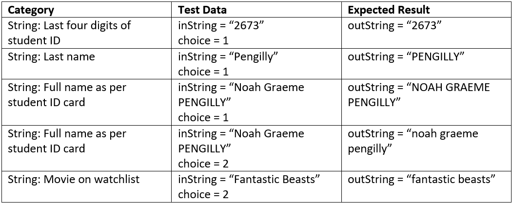
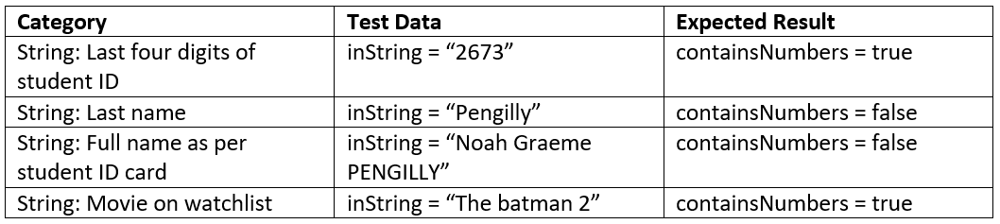
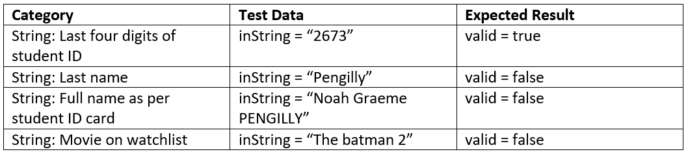
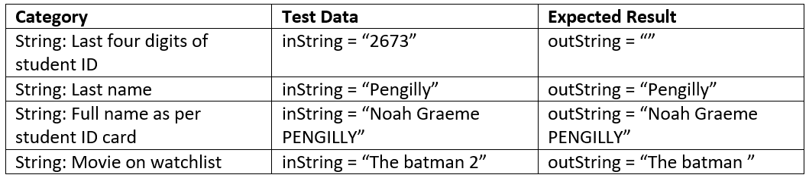
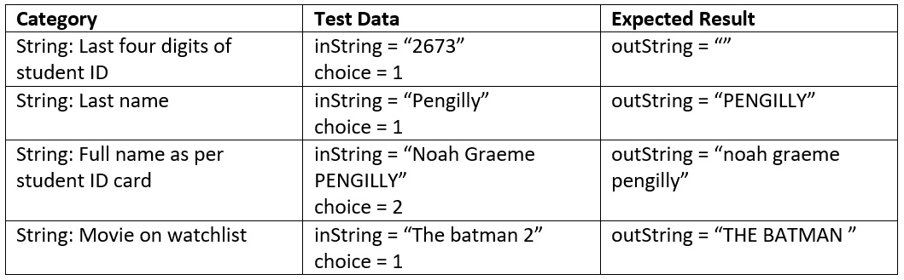
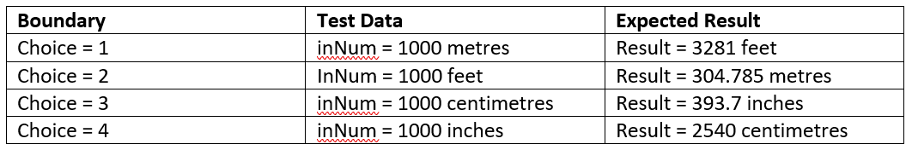
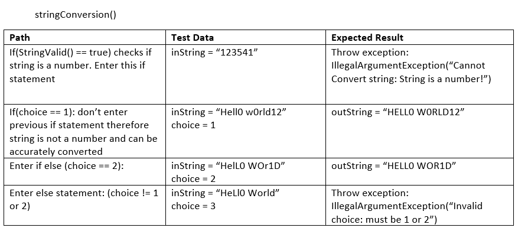
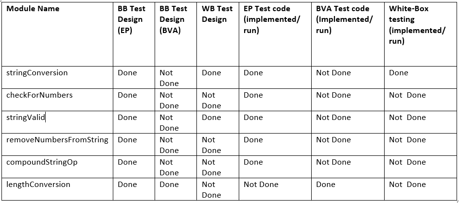
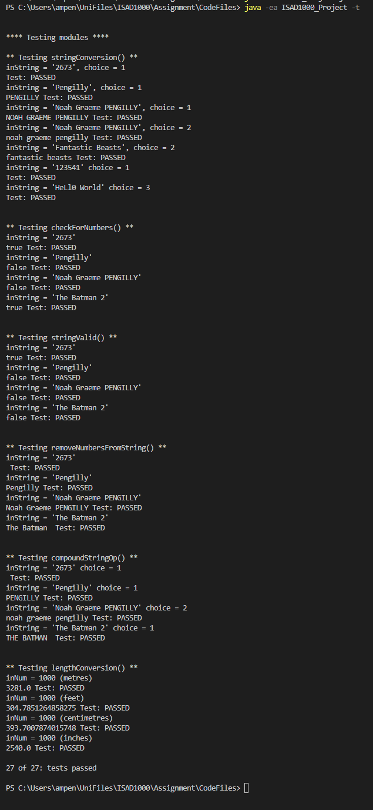

# ISAD1000 ISE Assignment Report
#### Name: Noah Pengilly
#### Curtin Student ID: 21032673
#### Practical Class: Wednesday 8am Bently Campus
## Introduction:
For my assignment I have implemented all the category 1 code requirements as well as category 2a. While working on the code I have been saving it all to a gitHub repository. This has allowed the code from different stages to be reviewed and conduct version control of the code.

## Module descriptions:
* startStringCon(): This module allows for user input taken from a keyboard before running the module stringConversion().

* stringConversion(): This module takes in a string and an integer. The input string is the string that will be modified the integer is to choose if this string is to converted to upper or lower case. The module returns the result String. This module takes input from a passed string and integer.

* startNumCheck(): This module allows for the user input before running the module checkForNumbers(). This module takes input from the users keyboard.

* checkForNumbers(): This module checks if an input string contains numbers and returns the boolean value of true if it does. This module takes input from a passed string

* startStringValid(): This module allows for user keyboard input before running the module stringValid().

* stringValid(): This module is passed a String variable and returns a true boolean variable if this string can be converted to an integer(number). 

* startCompStringOp(): This module allows for user keyboard input. The string that is input by the user they are then given the option to convert the string to upper or lower case (This is selected by keyboard input). The module compoundStringOp() is then attempted.

* compoundStringOp(): This module is passed a string and an integer. The integer is the choice if the input string will be converted to upper or lower case. Before this is done numbers are removed from the string using the module removeNumbersFromString(). Once numbers are removed it uses the module stringConversion() discussed earlier to convert the case of the string.

* removeNumbersFromString(): This module loops through each character in the string and checks if it is a number. If it is not a number than the character/letter is added to the output string. The result output string will be the input string without numbers.

* startNumCon(): This module allows for user keyboard input. The user is asked to enter the number they would like to convert and then asked what unit of measure the string they entered is. If they select metres it will be converted to feet and vice versa, if they select inches it will be converted to centimetres and vice versa. The conversion operations is conducted by the module lengthConversion(), which takes in the number to be converted and the unitOfMeasure determined by the user.

* lengthConversion(): This modules is for category 2a. This modules takes in a number that repressents a length value and depending on what the second number passed in will convert the number to the length required. If a 1 is passed in metres are converted to feet, 2 for the opposite. If a 3 is passed in centimetres are converted to inches, 4 for the opposite.

* readStructuredFile(): This module will take in a structured text file(style is shown in structuredFile.txt). The structured text file contains strings and two numbers to demonstrate each module above and their outputs. Once the contents of the file has been read in it is stored in a string array and this is passed to readFileOperations which runs the modules to be demonstrated.

* readFileOperations(): This module will take in a String array of file contents, this array is created by readStructedFile(), this module will then demonstrate all the modules required for category 1 and the module for length conversion, category 2a. This includes modules, stringConversion(), checkForNumbers(), stringValid(), compoundStringOp(), lengthConversion(), lengthConversion().

* readOrdinaryFile(): This module reads in an ordinary text file and operates on each line of the file. For each line. The string is converted to uppercase, checked for numbers, if the string is a valid number and the compound string operation (deleting numbesr and converted to lowercase). The modules required to do this inlude, stringConversion(), checkForNumbers(), stringValid(), compoundStringOp()

## Modularity:
To run the code type "java ISAD1000_Project" into command line to start the program. Once the program has started a menu is displayed, options of the menu can be selected by entering the correlated number with the keyboard, or '0' to quit. Once the operation is selected it runs another module that asks for the users input depending on what is required for the operation. Once the operation is complete the menu is redisplayed and will continue to display after each operation until the user enters 0 to quit. 
The modules have low coupling as the input is not dependant on a specific input, for example any string can be input to most of the string modules designed and will return a correct output.

The modules also have high cohesion as they can be more easily reused.
Because many of these modules are not dependent on a specific starting scenario, a variable can be passed in a the expected result will always be the same. This allows modules to use each other to complete a task successfully. An example of this is the compoundStringOp() module which uses the removeNumbersFromString() and stringConversion() modules.

## Black-box test cases:
### Equivalence Partitioning:
Module: stringConversion()

Imports: inString (String), choice (Integer)

Exports: outString (String)

Takes in a string and the choice. If the choice is '1' the string is converted to uppercase, if the choice is '2' the string is converted to lowercase. If the integer choice is not equal to '1' or '2' then an error is thrown.

######

Module: checkForNumbers()

Imports: inString (String)

Exports: containsNumbers (Boolean)

Takes in a string and checks whether numeric values are present, if so returns true.

######

Module: stringValid()

Imports: inString (String)

Exports: valid (Boolean)

This module checks if a string is a valid number. To be a valid number it will only contain numeric values. If it is a valid number the module returns true

######

Module: removeNumbersFromString()

Imports: inString (String)

Exports: outString (String)

This module checks each character from a string and removes numeric values and returns the result string.

######

Module: compoundStringOp()

Imports: inString (String), choice (Integer)

Exports: outString (String)

This module takes in a string, removes numbers from the string using removeNumbersFromString() and then converts the string to upper or lower case using stringConversion() depending on the choice of upper or lower.

### Boundary value analysis:
Module: lengthConversion()

Imports: inNum (double), unitOfMeasure (Integer)

Exports: result (double)

This module takes in a number representing number of (unitOfMeasure) in lenght. The unitOfMeasure is represented by a 1,2,3 or 4. 1 being metres will be converted to feet. 2 being feet will be converted to metres. 3 being centimetres will be converted to inches. 4 being inches will be converted to centimetres.

## White-Box Testing:
Two methods that would benefit from white-box testing include stringConversion() and stringValid()

#### stringConversion():

#### stringValid():

## Test Implementation:
To test the code when running the code in command line to start the program type "java -ea ISAD1000_Project -t" This will enable assertions and start testing mode. Testing mode runs the module testingModules(). This modules tests the modules stringConversion(), checkForNumbers(), stringValid(), removeNumbersFromString(), compoundStringOp() and lengthConversion(). To test each module assertion is used to check that the results from the module are as expected. For each test in the testingModule of my code all tests passed. All the test data used for these tests is the same data used for the above black-box and white-box testing.

## Version Control:
This entire assignment has been tracked using git version control. The git repository can be found on gitHub and it tracks each version of the code throughout its production. Most of the changes that were saved for each version were the development of each module and changes with touch ups and bug fixes. Version control allowed me to roll back to earlier versions when there were errors with my code allowing a fresh start on a problem.

## Ethics and Professionalism:
A lack of ethical and professionalism when designing the code can result in harm to its users, authors and any other stakeholders of the code. The public could suffer from the use of the code if some of it has not been designed properly. An example of this could be financial loss where the code fails to identify a string which represents a monetary value, as a number resulting in it not being counted. This could also damage the reputation of the program and thus the company that sells / distributes the faulty software, further effecting employees and shareholders. The software is obligated to protect the public, being the user of the software and any person whos assets (tangible or Intangible) are effected, because improper results or errors in the program could result in the public to suffer a loss of there assets. Tangible assets can include property or money. Intangible could be their reputation or private identity.

Things that should be practices to avoid ethical and professional issues in the software project are described by the ACS Code of Professional Conduct. Two things from the code that should be practiced include, Honesty and Competence. 

To be honest in the development of the program the developer / developers must "be honest in their representation of skills, knowledge, services and products" (ACS, 2014. ACS Code of Professional Conduct). This means that if the program is faulty and this is known by developers of the program they must be honest with users, or the company publishing / purchasing the program of the faults present and how it affects the users experience / outputs. As well as honest with their abilities to produce the program to the person who commissioned them the project, before starting work.

Competence for a project is defined by the ACS code of professional conduct as "You will work competently and diligently for your stakeholders" This working to the standards set by stakeholders or employeers and presenting work that meet the standards of the task. This can also mean taking responsibility for work produced. This can mean that if the program results in issues for its users programmers could be held responsible as well.

## Discussion:
The program I have produced could be improved. This includes changes to how the program is testing, by providing more testing methods and a more modular design, rather than all test code in one module. The code I have made allows the user to enter a testing mode or general use mode. In general use mode it allows the user to make menu selections and try each module and then send them back to the menu until they quit the program. The testing mode runs the test module and outputs the results.

Aside from the program more test cases for the testing portion of the report could have been included.